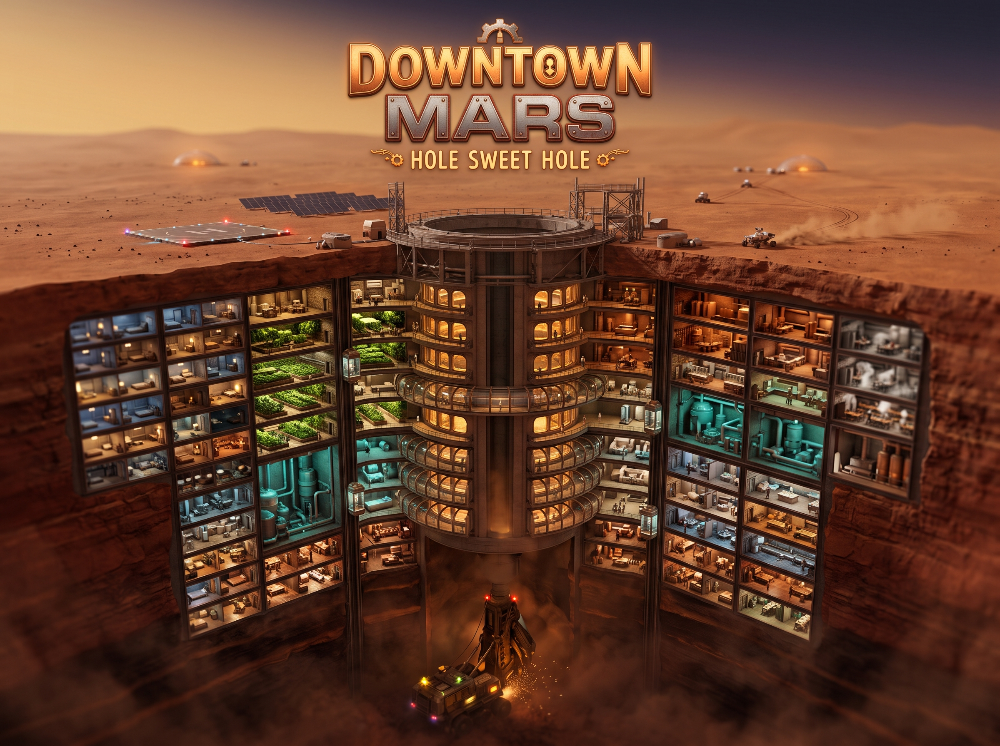
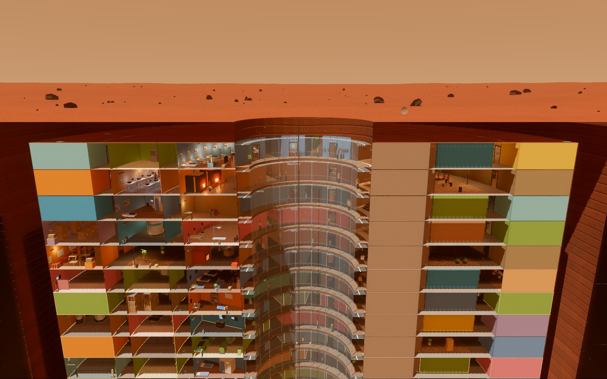
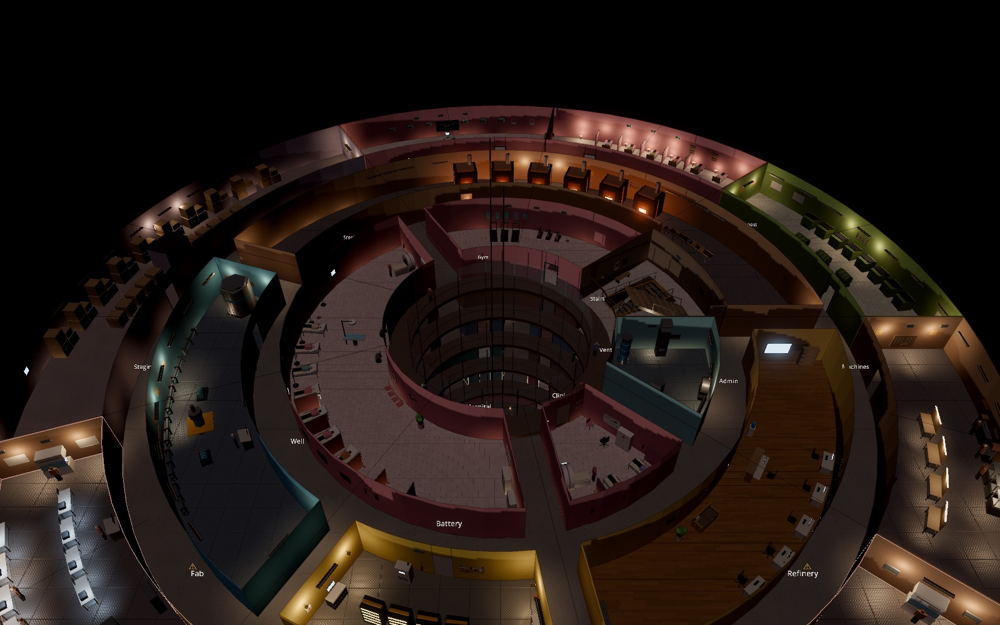
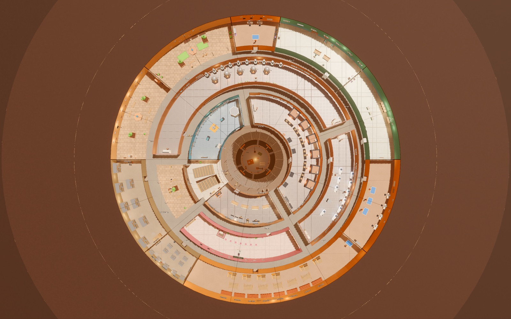
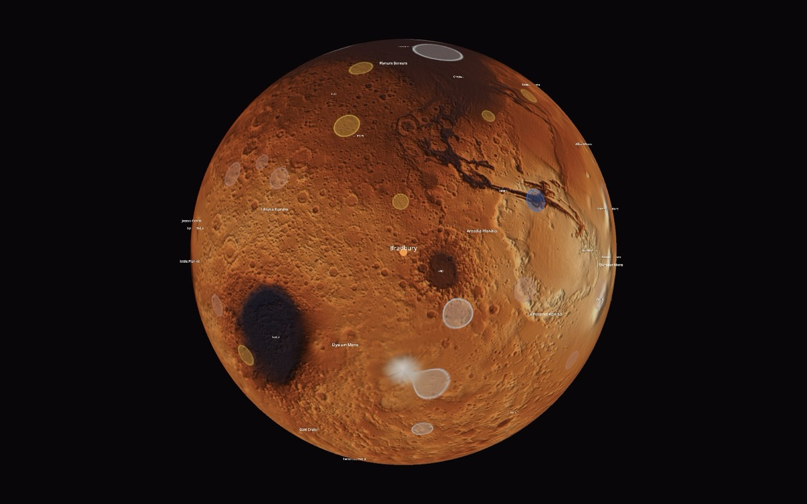
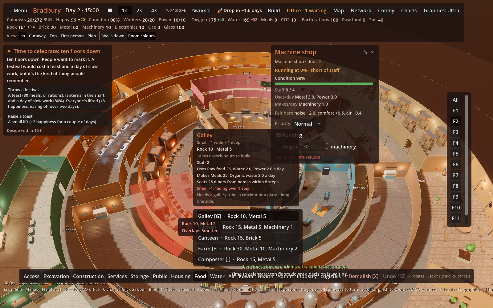

>[!NOTE]
> ***Play the game in your browser here:*** https://bdizzz.github.io/downtown-mars/




# Downtown Mars
*Hole sweet hole.*

A real-time city builder on Mars. Each city is a borehole: dig a shaft down, carve rooms into its walls in rings and floors, and keep everyone breathing, fed and sane. Rooms affect their neighbours, so where you put the noisy life support matters as much as whether you build it.

This is an early playtest build: a hole or two, the first hour or so of play. Total population supported is your score.

Working on the game? [docs/WORKFLOW.md](docs/WORKFLOW.md) shows how a playtest note becomes a merged change.

| | |
| --- | --- |
|  |  |
| **Cutaway:** twelve floors of rooms, sliced open | **Night:** lamps, furnaces and grow lights |
|  |  |
| **Top:** a floor as a plan you can build on | **The map:** NASA's elevation data, deposits and sites for new holes |



## What you do

- **Dig.** A boring machine sinks the shaft floor by floor. Every room slot starts as rock: excavate it, then build.
- **Build** homes, galleys, farms, life support, workshops and more in rings around the shaft, joined by glass gallery tubes, corridors and stairs.
- **Mind the neighbours.** Rooms spread noise, smell, comfort and health. Air and smell travel the corridors, and people only use what they can walk to.
- **Keep people going.** Watch oxygen, water, food and power; ride out dust storms; repair rooms as they wear; answer colonists at the office; decide what to do when the drill strikes something.
- **Grow.** Better homes unlock as the colony grows. At 50 colonists the map opens: send a convoy to found another hole and trade between them.

New games open with a short welcome card, then a tutorial from your deputy. The [player's guide](docs/GUIDE.md) covers everything in detail.

## Why not a game building habitats on the surface?

It's quite realistic. Burying a colony is one of the leading real proposals for living on Mars long term. Suits and ordinary habitats are fine for visits, but not for a lifetime.

**The numbers:**
- NASA's Curiosity rover measured about **0.6–0.7 mSv a day** on the surface. That's roughly **230 mSv a year**, about 100 times the natural background on Earth.
- NASA's career limit for astronauts is **600 mSv**. Living on the surface unshielded would use that up in about **2–3 years**.
- **Space suits barely help.** They're built to hold air in and keep you warm, not to stop radiation.
- **Thin-walled habitats help a little.** They block most of the dangerous bursts from solar storms, but not the steady background radiation.

**Why going underground works:** the radiation mostly comes from two sources:
1. **Cosmic rays:** a steady stream of very high-energy particles from deep space. They're the main long-term danger and very hard to stop. A thin shield can even make things worse, because the particles shatter in it and spray secondary radiation. You need a lot of mass, about **2–3 m of rock or soil** or more. Living a floor or more below ground does that job well.
2. **Solar storms:** occasional bursts of particles from the Sun. They're dangerous in the moment but easy to block. A few centimetres of water or plastic does it.

Being underground also helps with Mars's other problems: temperature swings of more than 100 °C between day and night, and small meteorites. Real proposals include habitats buried under soil, lava tubes, and dug-out caverns. Your borehole fits right in.

## Playing

The latest `main` is playable at **https://bdizzz.github.io/downtown-mars/** (rebuilt on every push), and each open pull request at `…/downtown-mars/pr-preview/pr-<N>/` (linked from the PR, with saves of its own). To run it locally (Node 24; `nvm use` picks it up from `.nvmrc`):

```bash
npm install
npm run dev        # play at http://localhost:5173
```

The essentials:

| Key | Does |
| --- | --- |
| B V C M | Build, View, Charts and Map |
| Space | Pause / resume |
| − + | Slower / faster |
| R, Z, X | Rotate, corridor tool, demolish (in Build) |
| ⌘Z / Ctrl+Z | Undo your last placement |
| ↑ ↓ | Floor up / down |
| ? | All the controls |

It plays in mobile browsers too: tap to aim and tap again to build, drag to turn, two fingers to pinch, twist and pan (best on a tablet in landscape; see Controls in the [guide](docs/GUIDE.md)). Add it to the home screen (Android: ⋮ → Install app; iPhone: Share → Add to Home Screen) and it opens full screen with its own icon.

The game autosaves every month (one game day) in your browser. Use the menu to save to a slot or export a save file.

## Developing

```bash
npm test              # simulation tests
npm run playtest      # scripted first month, printed day by day
npm run playtest:net  # scripted first hour across two holes
npm run package       # build and zip for a playtest upload
```

- **CI:** GitHub Actions type-checks and tests every PR and push to `main` (`.github/workflows/ci.yml`), and publishes each push to `main` to GitHub Pages (`pages.yml`). Dependabot opens one grouped PR a week for npm packages and one for Actions.
- **Packaging:** `npm run package` writes `release/downtown-mars-v<version>.zip` with `index.html` at the top. To publish on itch.io, create an HTML project, upload the zip, and tick "This file will be played in the browser". Nothing is uploaded automatically.
- **Home-screen install:** `public/manifest.webmanifest` makes the web game installable; its icons in `public/icons/` are drawn by `node scripts/icons.mjs` (rerun after changing the drawing, and commit the PNGs).
- **Workflow:** playtest notes become tickets and tickets become PRs through a handful of Claude Code skills (`/note`, `/ingest`, `/board`, `/build`, `/try`, `/land`); `docs/WORKFLOW.md` explains the stages and why.
- **Design docs** live in `docs/`: start with `DECISIONS.md`, then `DESIGN.md` and the catalogs. `ROOM-STATUS.md` lists which rooms are built and which are only described (regenerate it with `node scripts/room-status.mjs`). Milestone plans are `PLAN.md` and `PLAN-M2.md` to `PLAN-M14.md`.
- **Architecture:** see `CLAUDE.md`. The simulation is pure TypeScript in a Web Worker, deterministic, with all its numbers in `data/*.json`.

### Console commands

For testing, the browser console has `dm`, which acts on the hole you're looking at. `dm.help()` lists them all.

| Command | Does |
| --- | --- |
| `dm.resources()` | Shows what the hole has |
| `dm.give("metal", 50)`, `dm.take(...)`, `dm.set(...)` | Change a resource (or several: `dm.give({ metal: 50, rock: 100 })`) |
| `dm.fill(1000)` | Raises every stored resource to at least that much |
| `dm.unlock()` | Unlocks every room waiting on a milestone (or one: `dm.unlock("cargo")`); `dm.unlock("ore")` puts a deposit under the hole |
| `dm.finish()` | Finishes everything in the construction queue |
| `dm.showcase(12)` | Digs 12 floors and fills rings 1–3 with furnished rooms, for looking at and stress-testing |
| `dm.skip(3)` | Runs every hole ahead 3 months (game days; up to 365) |
| `dm.wear(0.4)` | Sets every room's condition to 40% (`dm.wear(0.2, roomId)` for one) |
| `dm.lining(12, "brick")` | Lines room 12's walls outright: `rock`, `brick` or `metal`, `"fine"` as a third argument for the finer finish; `dm.floor(12, "fibre_panels")` its floor (`dm.floor(12)` back to matching) |
| `dm.storm(1)` | Starts a dust storm for a month; `dm.storm(2, 3)` forecasts one in 3 months; `dm.storm(0)` clears it |
| `dm.event("belt_ship")` | Raises any event now |
| `dm.snapshot()`, `dm.command({ ... })` | The latest snapshot; send any simulation command (`SimCommand` in `src/sim/commands.ts`) |

Changes go through the simulation like any command and show in the flow report as "Console". Giving more than the hole can store also adds that much storage, so the amount isn't thrown away on the next tick.

### The Godot viewer (experiment)

A desktop viewer in Godot 4 and C# (`godot/`, Mac for now) that draws the same game: the sim runs in Node and talks to the viewer over a local socket. See `docs/PLAN-GODOT.md`. It needs Godot .NET 4.7 and the .NET SDK. (The screenshots above are from it.)

```bash
cd godot && dotnet build && godot-mono --path .
```

It starts the game by itself, continuing the last autosave; quitting saves and stops it. Add options after `--`:

| Option | Does |
| --- | --- |
| `--new`, `--showcase=12`, `--load=save.json` | A new game, a big test colony, or a save |
| `--floor=4`, `--view=cutaway`, `--plan`, `--walk` | Start on a floor, camera, the plan, or in first person |
| `--quality=low` | Graphics level |
| `--shot=10`, `--no-hud` | Save a screenshot to `godot/shots/` after 10 s and quit; hide the interface |
| `--bench=8` | Measure frame times and quit |
| `--port=7979` | Use a bridge on another port |

To run the game yourself instead (the viewer then just connects), use `npm run bridge -- --showcase=12`. The bridge serves on `127.0.0.1:17878` (its log: `~/.downtown-mars/bridge.log`) and takes `--load`, `--showcase`, `--speed`, `--hour=12` and `--verbose`. Saves go to `~/.downtown-mars/saves`; a web save exported to a file can be imported there, and back.

The viewer has the web game's views (Free view, Cutaway, first person, the plan with its overlays), building with the room card and effect halo, corridor chains, demolish and undo, the room panel, the resource bar with its tooltips, office, charts, map, network and colony panels, the tutorial, help (? or F1) and settings. F2 cycles the graphics level; F12 saves a screenshot.

### Furnishing tool

Run `npm run dev` and open `http://localhost:5173/?furnish` to see the furniture models (Catalogue) and lay out the template for any room type and shape (Templates). Drag items in the plan, set their wall, offsets, turn, repeat and priority, and save: the tool writes `data/layouts.json`. **Overview** shows every template side by side. Models are built in `scripts/furniture.mjs` (`node scripts/furniture.mjs` writes `data/furniture.json`); see `docs/FURNITURE.md`.

## Credits

Mars elevation: NASA Mars Global Surveyor, Mars Orbiter Laser Altimeter (MOLA) Mission Experiment Gridded Data Records (PDS Geosciences Node), public domain.

- `MEGT90N000EB` (16 px/degree): `scripts/build-relief.mjs` draws the map's shaded relief, `data/mars-relief.jpg`, at 8 px a degree.
- `MEGT90N000CB` (4 px/degree): `scripts/build-elevation.mjs` averages it to 1° for the game's own grid, `data/mars-elevation.json`.
