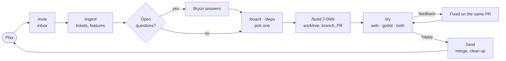

# The dev workflow

How a playtest note becomes a merged change: the stages, which skill runs each, and why it's done this way. The skills live in `.claude/skills/` and lean on three scripts: `scripts/board.mjs` (tickets and the board), `scripts/try.mjs` (running a branch) and `scripts/land.mjs` (merging and cleaning up).

Think of it as a restaurant: notes are orders scribbled on a pad, tickets are the order slips pinned on the rail, each `/build` is one cook at their own station, `/try` is the tasting, and `/land` sends the plate out and wipes the station.

## The flow

1. **Play and note.** While playing, `/note <text>` drops the thought into the local inbox (`.tracker/`), word for word. Nothing else happens, so it's quick and never breaks the flow of play.
2. **Ingest.** `/ingest` turns the inbox into tickets (`docs/tickets/T-0NN-…md`) with a size (S, M, L), the likely files, an approach and any open questions; big items become features (`F-0NN`, below). Every note is archived verbatim in `docs/tickets/notes-archive.md`. The tickets are committed straight to main and pushed.
3. **Answer.** Tickets with open questions show as "needs answers". Answer them in one reply (to `/ingest`, `/board` or `/build`), and they become ready.
4. **Pick.** `/board` lists features, then what's ready, needs answers, blocked, in flight and in review. `/deps` draws the dependency tree. Ask for "a quick win" or "the oldest" if nothing in particular calls.
5. **Build.** `/build T-0NN` checks open PRs for overlap, makes a `t-0NN-…` branch from a fresh `origin/main` in its own worktree, claims the ticket by pushing that branch, builds it, runs `npm test`, checks it in the browser on `[::1]:5173` (so the main game's saves aren't touched), updates the docs, marks the ticket done on the branch, and opens a PR with a link to its playable preview.
6. **Try.** `/try T-0NN web|godot|both` starts that worktree's dev server (a port from 5174) or Godot viewer (a bridge port from 7980, scratch saves) in the Terminal panel, and says what to look at. Or play the PR preview on any device. Feedback given afterwards goes on the PR as a checklist and gets fixed on the same branch.
7. **Land.** `/land T-0NN` squash-merges the PR if CI is green, stops its servers, removes its worktree, deletes its branches, updates main and shows what's ready next. `/land` alone sweeps up anything already merged.

### Features

For items too big for one ticket (a new system, a milestone's worth):

1. `/ingest` makes a **draft** feature with a goal, a design sketch and a rough breakdown.
2. `/build F-0NN` writes or revises its plan (a doc-only PR on `f-0NN-…`, with a `docs/PLAN-M*.md` if the design is big). Merge it with `/land`.
3. **Agree** it in `/board` ("agree F-0NN"): each breakdown line becomes a task ticket with `feature: F-0NN`. Each task's build reads the feature first and treats its design as settled.
4. Optionally, build it **on a branch of its own** (`feature/f-0NN-…`) to test the whole thing before it reaches main: tasks branch from it and their PRs merge into it, `board.mjs sync F-0NN` keeps it current with main, a draft PR into main gives a preview of the feature so far, and it lands last with a merge commit.

## Which skill when

| Skill | Use it when | Example |
| --- | --- | --- |
| `/note` | Something strikes you while playing | `/note glass rooms look too dark at night` |
| `/ingest` | The inbox has notes waiting (the board says so) | `/ingest` |
| `/board` | Choosing what's next, answering questions, agreeing a feature | `/board`, "agree F-004" |
| `/deps` | Seeing what's blocked on what | `/deps 14` (keep done tickets on it for 14 days) |
| `/build` | Building a ticket, or planning a feature | `/build t65`, `/build quick win`, `/build F-008` |
| `/try` | Playing a branch before it merges, then giving feedback | `/try t65 both`, then "make it brighter" |
| `/land` | A PR is good to merge, or to tidy up after merges | `/land t65`, `/land` |

Ids can be shorthand in commands and chat (`t6` is T-006, `f1` is F-001); files, branches and commits use the full form.

## Behind the scenes

- **Status comes from GitHub.** A ticket file stores only `open`, `done` or `dropped`. A pushed `t-0NN-…` branch means in flight, an open PR in review, a merged PR done; open questions mean needs answers, and an unfinished `blocked_by` (or a draft feature) means blocked. `node scripts/board.mjs menu` works it all out live. See `docs/tickets/README.md`.
- **Tickets go straight to main**; everything else goes through a PR. `board.mjs publish` commits only `docs/tickets/` and pushes it.
- **A SessionStart hook** (`.claude/hooks/fresh-main.sh`) fetches `origin/main` at the start of every session, and fast-forwards a clean `main` checkout.
- **CI** (`.github/workflows/ci.yml`) type-checks and tests every PR and push to main. **Previews** (`preview.yml`) publish each PR to `https://bdizzz.github.io/downtown-mars/pr-preview/pr-N/`, rebuilt on every push and removed when the PR closes, with their own saves and the PR number in the tab title (`#N · Downtown Mars`). **Pages** (`pages.yml`) publishes main.
- **Commits** follow Conventional Commits (`fix(render3d): … (T-003)`; see CLAUDE.md, "Commit messages"), and PR titles do too.
- **The main checkout** is for playing and taking notes; builds happen in worktrees under `.claude/worktrees/`.

## Why it's done this way

- **Notes are kept word for word**, so nothing is lost in translation; a ticket can always be checked against what was actually said.
- **Notes and tickets are separate steps**, so jotting a note costs nothing while playing, and the thinking (size, files, questions) happens later in one batch.
- **Questions are asked up front**, on the ticket, so a build session doesn't stall halfway or guess at a design call that's Bryon's.
- **Tickets are checked in**, so any machine (or a cloud session) can build one with all its context.
- **Status is worked out from GitHub**, so it never needs syncing and two sessions can't write conflicting states.
- **One ticket per branch, worktree and PR**, so several sessions can work at once without stepping on each other, and each change can be reviewed, tried and reverted on its own. The overlap check catches two PRs about to fight over the same system.
- **Features are planned before they're split**, so their tasks share one agreed design and each still lands as a small PR that leaves the game working.
- **Previews and `/try`** let a change be played before it merges, on a phone or the desktop, without disturbing the main game or its saves.
- **Feedback goes on the PR**, so the fix stays with the change it belongs to, and the PR records what was asked for.
- **`/land` does the cleanup**, so worktrees, branches and dev servers don't pile up.
- **Conventional Commits** keep the history readable at a glance.
